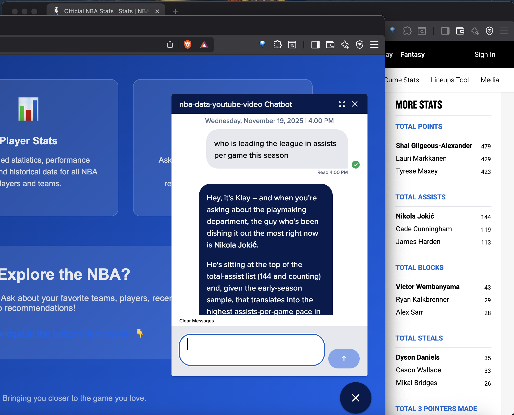

# NBA Chat Agent 🏀

A simple NBA-themed AI agent using DigitalOcean's AI chat agent widget. This basic web app serves a static HTML page with basketball styling and an embedded chatbot interface.



The data is pulled and indexed from nba.com/stats daily and auto-added to our agent's knowledge base.

## Features

- 🤖 **AI Chat Widget**: Embedded chatbot for NBA-related conversations

## Tech Stack

- **Frontend**: Static HTML, CSS, JavaScript
- **Backend**: Simple Node.js Express server (serves static files)
- **Chat Widget**: Third-party embedded chatbot widget from DigitalOcean
- **Styling**: CSS with gradients, animations, and responsive design

## Quick Start

### Prerequisites
- Node.js (v14 or higher)
- npm

### Installation

1. Clone the repository:
```bash
git clone https://github.com/elizabethsiegle/nba-chat-knowledgebase-youtube-video.git
cd nba-youtube-video-agent
```

2. Install dependencies:
```bash
npm install
```

3. Start the server:
```bash
npm start
```

4. Open your browser and navigate to:
```
http://localhost:8080
```